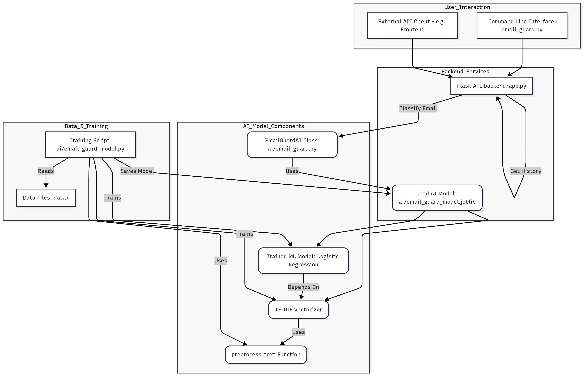

# Smart Email Guardian: AI-Powered Spam & Phishing Detection Toolkit



## Overview

EmailGuard is a comprehensive toolkit designed to classify emails as "legitimate," "spam," or "phishing" using a machine learning model. It offers a flexible solution with both a command-line interface (CLI) for quick, on-demand scanning and a robust Flask-based RESTful API for seamless integration into larger applications or services.

Built with `scikit-learn` and `Flask`, and packaged as a reusable Python SDK, EmailGuard aims to provide a reliable first line of defense against unwanted and malicious emails by leveraging natural language processing and machine learning techniques.

## Features

* **Intelligent Classification:** Uses a trained machine learning model to accurately categorize emails.
* **Reusable Python SDK:** Core AI logic is packaged as an installable Python library (`email-guard-sdk`).
* **Dual Interface:** Access functionality via a simple command-line tool or a RESTful API.
* **Dockerized Deployment:** Full stack (backend and frontend) can be run as isolated containers using Docker Compose.
* **Robust Text Preprocessing:** Handles noisy email data by cleaning, normalizing, and transforming text for optimal model performance.
* **Comprehensive Documentation:** Detailed guides for setup, usage, and internal architecture.
* **Security Considerations:** Built with an awareness of security best practices, including API key authentication.
* **Scan History UI:** Frontend displays a history of recent email scans.

## Live Demo

* **Frontend (Web App):** [YOUR_DEPLOYED_FRONTEND_URL_HERE] (e.g., Vercel URL)
* **Backend (API Base URL):** [YOUR_DEPLOYED_BACKEND_URL_HERE] (e.g., Render/Railway URL)

## Getting Started (Local Development)

To get EmailGuard up and running on your local machine, you have two primary options: using Docker Compose (recommended for full stack) or running components individually.

### Option 1: Run with Docker Compose (Recommended)

This method uses Docker to run both the backend API and the frontend web app in isolated containers, mirroring a production environment.

1.  **Install Docker Desktop:** Ensure Docker Desktop is installed and running on your system.
2.  **Clone the Repository:**
    ```bash
    git clone [https://github.com/Nohayla10/email_guard.git](https://github.com/Nohayla10/email_guard.git)
    cd email_guard # Or whatever your project root is named
    ```
3.  **Train the AI Model Locally (Once):**
    The AI model needs to be trained and saved into the SDK's package structure locally before Docker can copy it.
    * Create and activate a virtual environment:
        ```bash
        python -m venv venv
        # On Windows: .\venv\Scripts\activate
        # On macOS/Linux (Git Bash): source venv/bin/activate
        ```
    * Install core dependencies:
        ```bash
        pip install -r requirements.txt
        ```
    * Download NLTK Data:
        ```bash
        python -c "import nltk; nltk.download('stopwords'); nltk.download('wordnet')"
        ```
    * **Train and save the model:**
        ```bash
        python ai/email_guard_model.py
        ```
        This will save `email_guard_model.joblib` to `email_guard_sdk/model/`.
4.  **Set API Key in `docker-compose.yml`:**
    Open `docker-compose.yml` in your project root and replace `"your_super_secret_email_guard_key_123"` with your desired strong API key for both `backend` and `frontend` services.
5.  **Build and Run Docker Containers:**
    From the project's root directory, run:
    ```bash
    docker-compose up --build
    ```
    This will build the Docker images (installing the SDK into the backend image) and start both services.
6.  **Access the Application:**
    Open your web browser and navigate to `http://localhost:3000`.

### Option 2: Run Components Individually (Local Development)

This method is useful for developing and debugging individual components without Docker.

1.  **Clone the Repository:**
    ```bash
    git clone [https://github.com/Nohayla10/email_guard.git](https://github.com/Nohayla10/email_guard.git)
    cd email_guard
    ```
2.  **Create and Activate a Virtual Environment:**
    ```bash
    python -m venv venv
    # On Windows: .\venv\Scripts\activate
    # On macOS/Linux (Git Bash): source venv/bin/activate
    ```
3.  **Install Python Dependencies:**
    ```bash
    pip install -r requirements.txt
    ```
4.  **Download NLTK Data:**
    ```bash
    python -c "import nltk; nltk.download('stopwords'); nltk.download('wordnet')"
    ```
5.  **Build and Install the EmailGuard SDK Locally:**
    This makes your AI logic available as a Python package in your virtual environment.
    ```bash
    python setup.py sdist bdist_wheel
    pip install dist/email_guard_sdk-0.1.0.tar.gz # Adjust filename if version differs
    ```
6.  **Train the AI Model:**
    ```bash
    python ai/email_guard_model.py
    ```
    This will save `email_guard_model.joblib` to `email_guard_sdk/model/`.
7.  **Configure API Key (.env):**
    Create a `.env` file in the project's root directory and set your `API_KEY`:
    **`.env`:**
    ```
    API_KEY="your_super_secret_email_guard_key_123"
    ```
    Also, create a `.env` file in `frontend/web/` for the React app:
    **`frontend/web/.env`:**
    ```
    REACT_APP_BACKEND_URL=http://localhost:5000
    REACT_APP_API_KEY="your_super_secret_email_guard_key_123"
    ```
    **Important:** Ensure `.env` files are listed in your `.gitignore`.
8.  **Run the Backend Server:**
    Open a **new terminal** window, navigate to your project root, activate the virtual environment, and run:
    ```bash
    export FLASK_APP=backend/app.py
    export FLASK_ENV=development
    flask run --host=0.0.0.0 --port=5000
    ```
    Leave this terminal running.
9.  **Run the Frontend Web App:**
    Open another **new terminal** window, navigate to `frontend/web/`, and run:
    ```bash
    npm install # Only if you haven't already
    npm start
    ```
    This will typically open the app in your browser at `http://localhost:3000`.

## Usage

### Command Line Interface (CLI)

Scan an email directly from your terminal (after installing the SDK locally as in Option 2):

```bash
python email_guard.py "Your Amazon order has shipped. Track it here: [example.com/track/123](https://example.com/track/123)"
