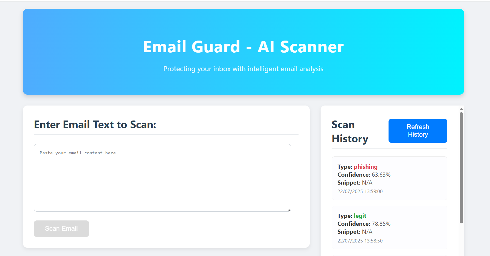
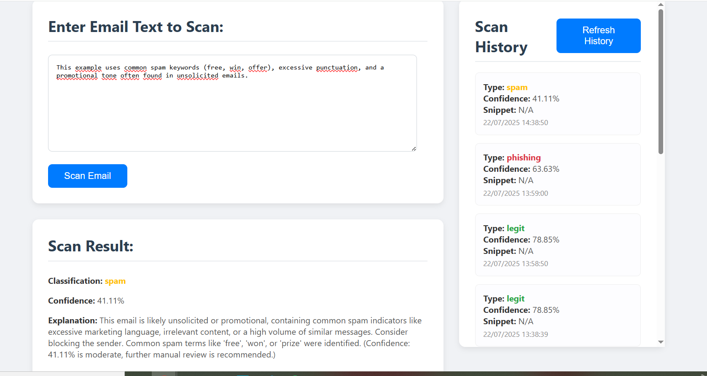
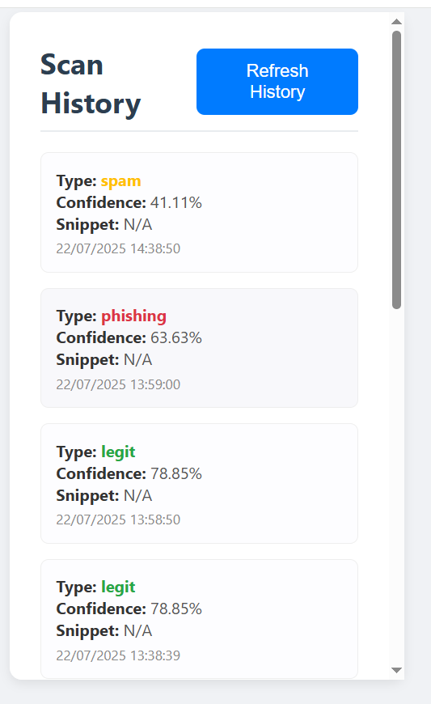

# Smart Email Guardian: AI-Powered Spam & Phishing Detection Toolkit


## Overview

EmailGuard is a comprehensive toolkit designed to classify emails as "legitimate," "spam," or "phishing" using a machine learning model. It aims to enhance digital security by providing a robust and accessible solution for identifying malicious and unwanted email content. It offers a flexible solution with both a command-line interface (CLI) for quick, on-demand scanning and a robust Flask-based RESTful API for seamless integration into larger applications or services.

Built with `scikit-learn` and `Flask`, and packaged as a reusable Python SDK, EmailGuard aims to provide a reliable first line of defense against unwanted and malicious emails by leveraging natural language processing and machine learning techniques.

## Features

* **Intelligent Classification:** Uses a trained machine learning model to accurately categorize emails (Phishing, Spam, Legit).
* **Confidence Score:** Provides a confidence level for each classification.
* **Explanation Generation:** Offers a basic explanation for the classification.
* **Reusable Python SDK:** Core AI logic is packaged as an installable Python library (`email-guard-sdk`).
* **Dual Interface:** Access functionality via a simple command-line tool (for developers/local use) or a full-fledged web application with a RESTful API (for end-users and integration).
* **Dockerized Deployment:** Full stack (backend and frontend) can be run as isolated containers using Docker Compose.
* **Robust Text Preprocessing:** Handles noisy email data by cleaning, normalizing, and transforming text for optimal model performance.
* **Security Considerations:** Built with an awareness of security best practices, including API key authentication for the backend.
* **Scan History UI:** Frontend displays a history of recent email scans (in-memory on backend, resets on backend restart/redeploy).

## Live Demo

Experience the Email Guard AI Scanner live!

* **Frontend (Web App):** [https://email-guard-4ns4xkit6-nohayla10s-projects.vercel.app/]
* **Backend (API Base URL):** [https://https://email-guard-production.up.railway.app/]

## Screenshots

Showcase your application in action:







## Technologies Used

**Frontend:**
* React.js
* axios (for API requests)
* HTML/CSS

**Backend:**
* Python 3
* Flask (Web Framework)
* Gunicorn (WSGI HTTP Server)
* Flask-CORS (for Cross-Origin Resource Sharing)
* scikit-learn (Machine Learning Library)
* NumPy, Pandas (Data processing)
* NLTK (Natural Language Toolkit for text preprocessing)
* joblib (for model persistence)

**Deployment:**
* Vercel (for Frontend)
* Railway.app (for Backend)
* Docker (for Backend Containerization)
* Git / GitHub (Version Control)

## Getting Started (Local Development)

To get EmailGuard up and running on your local machine, you have two primary options: using Docker Compose (recommended for full stack) or running components individually.

### Prerequisites

* **Node.js** (LTS version recommended) & **npm** (or yarn)
* **Python 3.8+** & **pip**
* **Git**
* **Docker Desktop** (for Option 1)

### 1. Clone the Repository

```bash
git clone [https://github.com/Nohayla10/email_guard.git] 
cd email_guard 